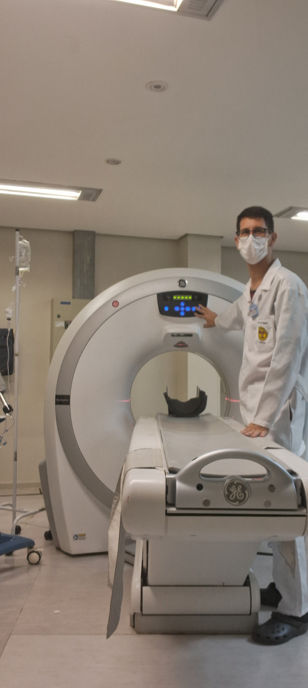

## Sobre Mim.....
Olá! Meu nome é **Vicente De Souza**. Sou um profissional dedicado e apaixonado por Radiologia e Tecnologia da Informação (T.I.). Resido no Rio Grande do Sul (R.S.) e estou constantemente buscando crescer, estudar e evoluir em minhas áreas de interesse.

## Minha experiência Profissional

### Radiologia
- Tenho experiência na área de Radiologia, onde aplico conhecimentos técnicos para realizar exames de imagem com precisão e cuidado.
- Trabalho com uma equipe dedicada para garantir a qualidade e segurança dos procedimentos radiológicos.

## Formação Acadêmica
- **Radiologia**: Formação técnica na área de Radiologia, com foco em diagnósticos por imagem.
- **Tecnologia da Informação**: Em andamento, com ênfase em desenvolvimento de software e infraestrutura de TI.

## Habilidades

- **Radiologia**: Realização de exames radiológicos, manuseio de equipamentos de imagem, atenção aos detalhes e cuidado com pacientes.##

- ## Hobbis
- **Caminhar, e escutar músicas.

- ## Links
- **Siga-me no Instagram: [@vicente_de_souza_](http://intagram.com/vicente_de_souza_)

- ## Mais sobre mim.
- Cresça, estude e evolua! Sua melhor vingança é o seu sucesso esplendor.Esta frase resume minha abordagem à vida e à carreira. Acredito que o aprendizado contínuo e a evolução pessoal são fundamentais para alcançar nossos objetivos e contribuir positivamente para a sociedade.
  
